# IAM

* IAM = Identity and Access Management, Global service
* Root account created by default, shouldn't be used or shared
* Users are people within your organization, and can be grouped
* Groups only contain users, not other groups
* Users don't have to belong to a group(don't have rule like user must be belongs to group), but this is not good practice and user can belong to multiple groups

**Creation of IAM User,Group,Assigning policies: Hands On**
* Login with root account
* Search IAM service
* Go to users on letf-side
* Click on create user 
* Provide name,select i want to create IAM user
* Select auto generated password, and select user to create new password at next sign in,click on next.
* If IAM user for your self,select custom password and unselect user to create new password at next sign in,click on next.
* Click on create group,provide name to group,select policies which are required to group,click on create user group.
* Group name will be listed in groups,select group,click on next.
* In tag provide information about user to easily identity his department or work.
     Ex: key=Department value=DevOps
* Click on create user

The policy attached to user via group(inherited policy to user) because user part of group.

**Creation of alias for account to login IAM user: Hands On**
* Go to IAM service,top right side there is account section.
* Click on create under account alias give some name (raghu-v10, must be uniqe).
* Below it given sign-in url,copy and share to user who has to login.
* Creation of alias will avoid us to sharing the account id.

    It is look like https://raghu-v10.signin.aws.amazon.com/console 

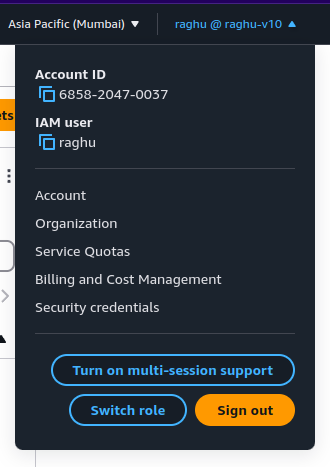

**IAM Policy**
* Creation of custom policy by attaching different permissions of service/services is called inline policy. 
* If user don't belong to any group,we have to attach policies to him seperately.

**Creation of IAM Policy and attaching to user/group: Hands On**
* Search IAM service,go to policies on left side.
* Click on create policy,select service,to which service this policy should have permission.
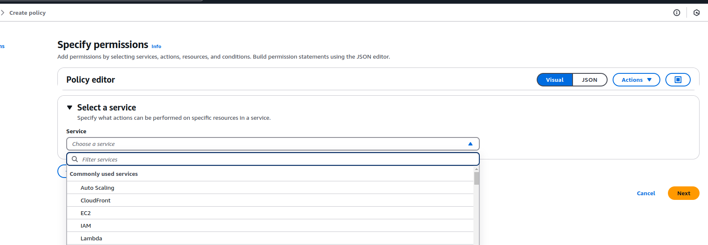
* Selected IAM as now,if your confirtable with policy structure select json to write policy. I am going with visual option.
* Under access list, have list,read,write,permission management,tagging
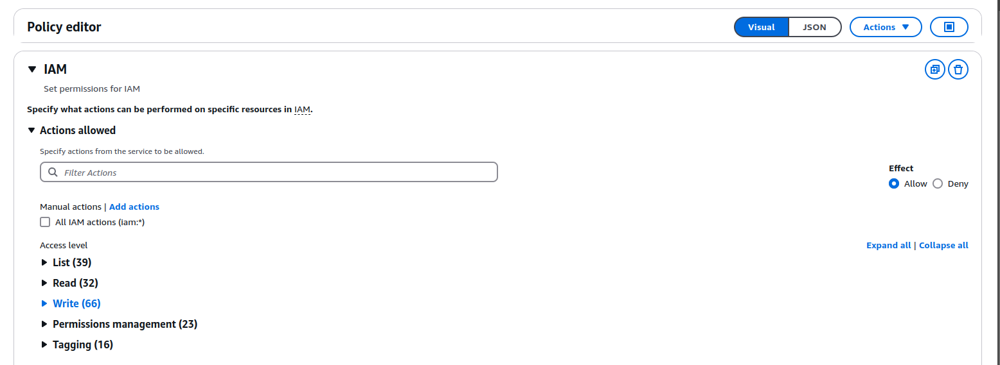
* Click on play button and select which all permission required for policy
* Selected list user,list group and get user
* Select All for resources
* Provide policy name,update description,use tag to add additional details.
* Click on create policy,go to users,click on user to which user need to attach
* Removed admin policy attached at the time of creation. click on add permissions,add policy,select attach policy directly
* Search for your policy name,select,click on next and add permissions

**Ways To Protect Users: Root account and IAM Users**
* IAM - Password Policy 
* Multi Factor Authentication

**MFA devices options in AWS**
* Virtual MFA devices
   1) Google Authenticator(phone only)
   2) Authy (phone olny) --> you can use it for multiple users(root,muiple IAM users)
* Universal 2nd factor security key --> 
   . Physical device and you can use it for multiple users(root,muiple IAM users) 
   . YubiKey by Yubico (3rd party)
* Hardware Key Fob MFA Device
   . Physical device 
   . Provided by SurePassID (3rd party)
* Hardware Key Fob MFA Device for AWS GovCloud (US)
   . Physical device 
   . Provided by SurePassID (3rd party)

**IAM Password Policy**
* On IAM service,click on account settings
* On password policy section,click on edit 
* Select custom,it provide following options showing in image to select
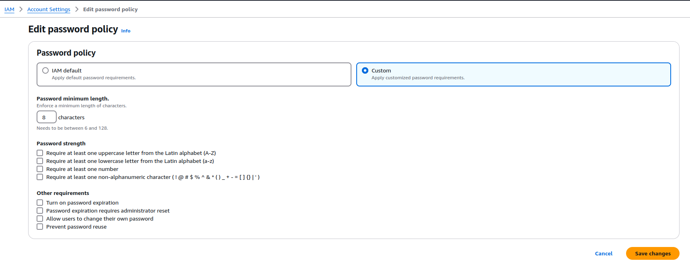
* Save changes,passward policy will be appied

**Enabling MFA To User**
* Click account on top right-side,click on security credential
* Click on assign MFA
* Give device name,select type of device(going with mobile app Duo Mobile)
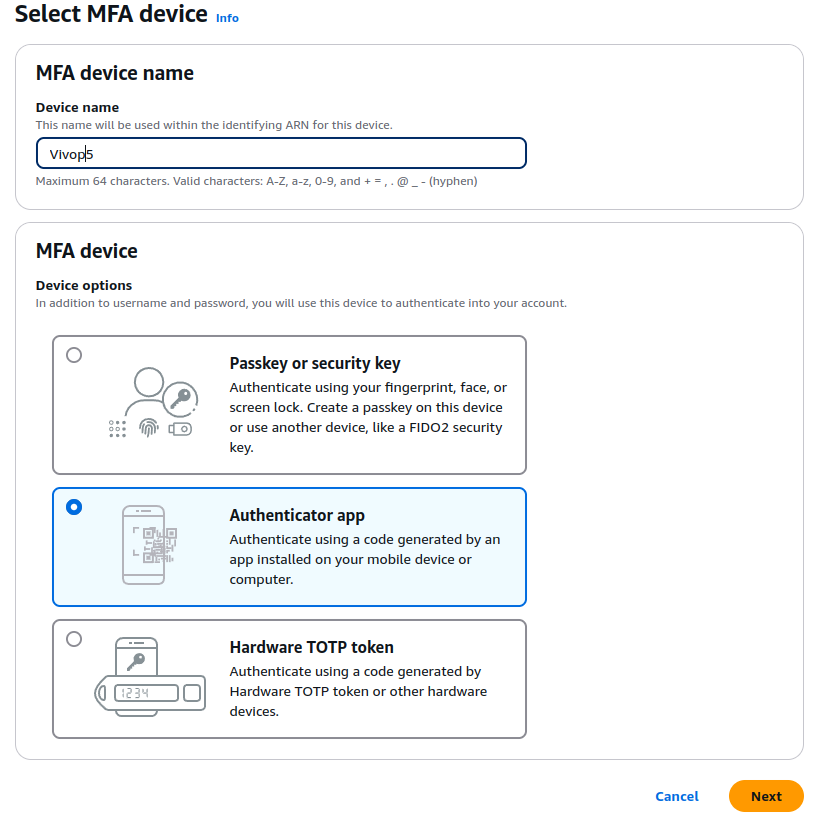
* Scan QR code from Duo Mobile app to add account to app
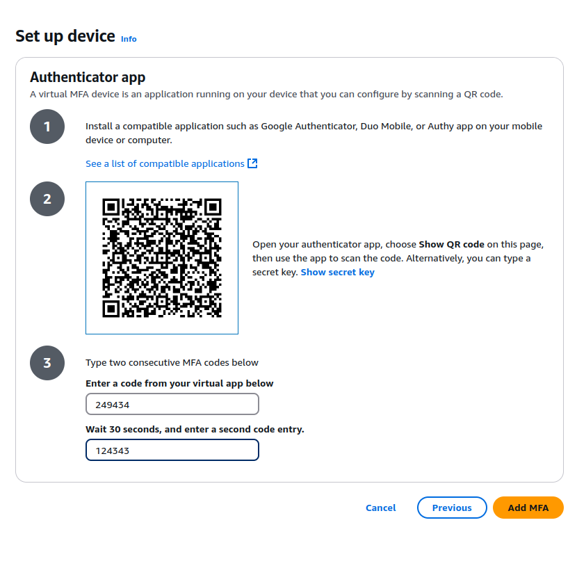
* Enter first two 6 digit code generated on mobile to complete setup
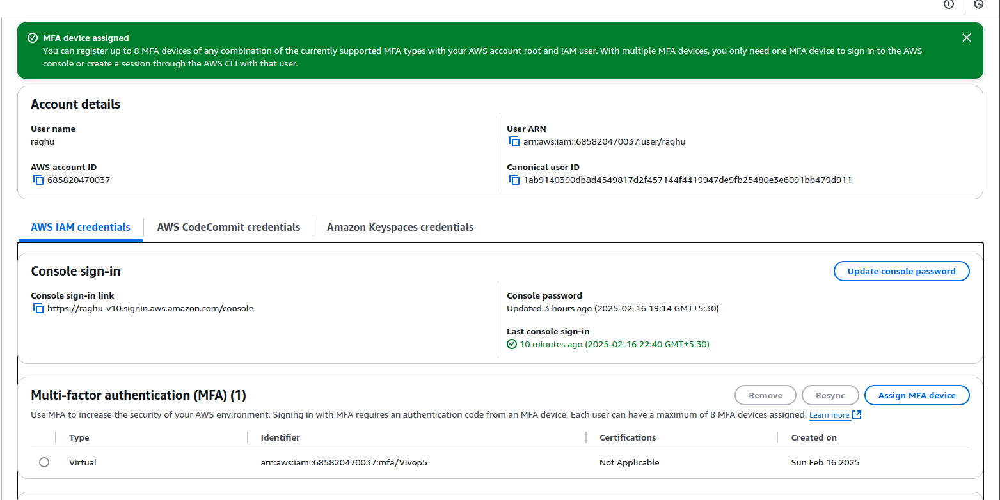

**Creation of Access key and Configure on AWS CLI**
* URL to login https://raghu-v10.signin.aws.amazon.com/console
* Login with IAM user
* Go to IAM service,click on users ,then click on user.
* Click on create access key on top right-side
* Select CLI as use changes,click on next.
* Provide description(optional),click on create
* Save access key id and secret access key id securely
* Download .csv file
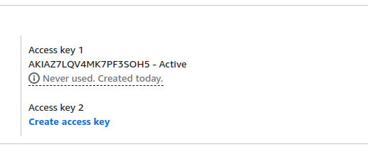
* In terminal,run aws configure,give access key,secret access key,region and leave output format as empty.
* Run any aws command,aws iam list-users --> list available users
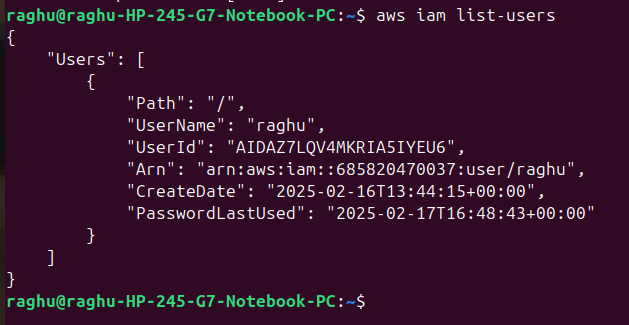

* AWS CloudShell is a terminal which is provided on cloud to interact with aws services. It is available in some of regions.
* AWS CloudShell will use credential you logged-in and use region as see on top right-side.
* we can create files/folder,download and upload file into aws cloud shell. files will be present even if restart CloudShell.
* we can open multiple cloud shell terminals and use them

**IAM Role**
* IAM role is just like user but intended to use by aws services to perfom actions on your behalf.
* To do so we need to assign permission to aws service with IAM Roles.

Ex: *we have EC2 instance,which need to perform some action with other aws service.
    *we will create IAM role,assign to ec2, ec2 will use role to perform action,
    once permissions are checked from other aws service,give required details.

**Creation of IAM Role**
* IAM service,click roles left-side
* Click on create role,select trusted entity as aws service,as of now we are creating role for aws services.
* Select service,to which service you are going to create. selected ec2,use case as ec2.
* Provide role name,description,select poliy to give permission to IAM role,as of now selected IAMReadOnlyAcess policy.
* Add additional details in tag(optional).click on create role.
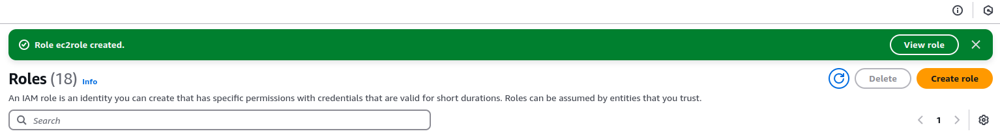

**IAM security tools**
* Credential reports: 
  * It is account level,it will list all your's account users and status of credential,
  means when passward created,last changes,last accessed etc
  * Go to IAM service,scole down below,click on credential reports,click on download credential report.
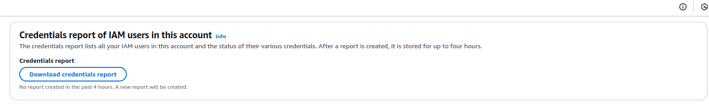

* Last access: 
  * It is user level,which give infomation about service permissions to user and those service were last access
  * Click on users in IAM service,click particular user,go to last access section,get the details.
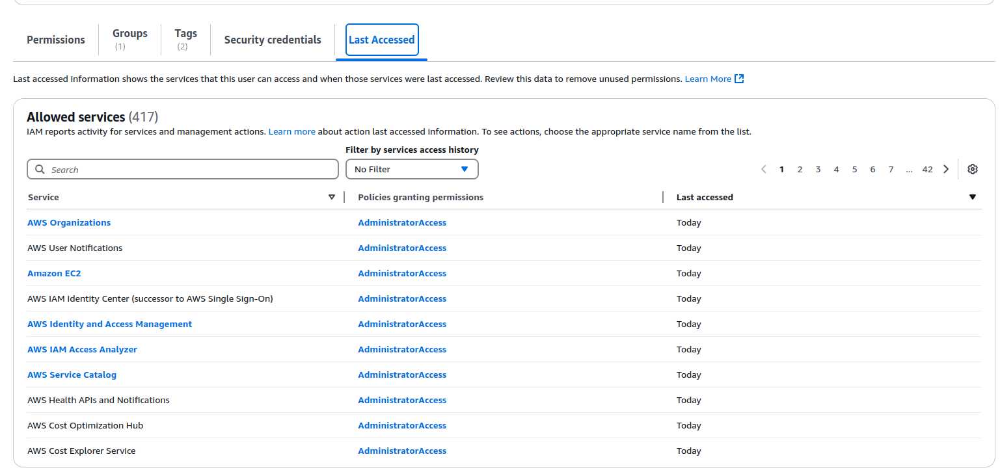

* Shared responsibilty between AWS and You. you will get question about shared responsibility.