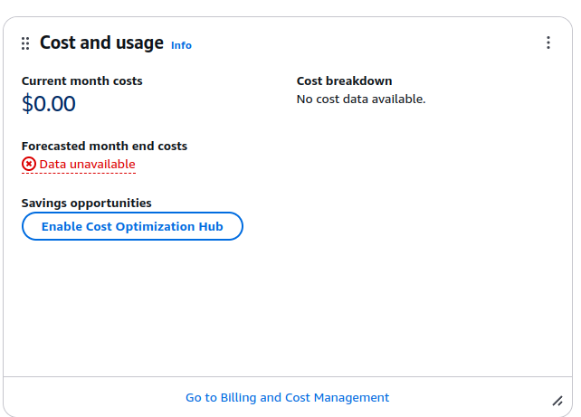

# EC2 Fundamentals 

**Enabling billing page to access by IAM users**
* Login with root user
* click on name which top right-site,click on account
* Come down,there is section called IAM user and role access to billing information
* click on edit

* select activate IAM access and update
* Before updating access

* After updated access

**Creation of budget for $1, login as IAM User**
* When spend reached $1 by mentioned in this,we will get mail
* Click on name top right-side
* Click on billing and cost management
* Click on budgets under Budget and Planing
* Click on create budget,select use a template in Budget setup
* Select zero spend budget as template,provide name to budget,enter mail details,click on create budget.

**Creation of Monthly budget**
* Follow above steps till fifth Point.
* Select monthly cost budget as template.
* Provide name to budget,enter monthly budget in Dollar. Provide email
* Click on create budget.

* Under Cost and Usage Analysis,click on free tier,you will get available free resource details.

* Under Billing and Payments section,click on Bills,come down,you will get charges details with service.

**EC2 instance creation**
* Search EC2 service
* Click on instances under Instances section left-side
* Click on launch Instances
* Give name to ec2 instance,select os image ex: Amazon linux,linux,rhel,windows
* Select architecture and instance type
* Click on compare instance types, you will get all instance types available in your region under Instance type.
* Create key pair to login using ssh,provide name,select .pem format which is used to login from linux,mac,windows 10 and greater version.
* Select .ppk to login using less than windows 10.
* Download ppk file.
* Keep network settings as default,check Auto assign public ip is enabled because we need public ip to login.
* Select ssh traffic to login into instance using ssh
* Select http traffic because we are deploying apache to serve,we need to access apache content.
* In configure storage,selected 8 GiB as storage,click on advanced option to check more storage types.
* In advanced details select,update command to run in user data section.  
* The script or command uploaded on to user data will be executed only once at instance first start.
* Copy script from ec2-fundamentals folder and update to user data section.
* Click on launch instance,you instance will be ready.

* Click on instance id,you will get all details about the instace.

* Within a minute we will get server to work,that is power of cloud.we stop instance,start whenever we need.
* Charges will not be applied when instance is in stopped state but you will get the charge for volume.
* when you start the instance the public ip will changed.
* We have installed apache(httpd) and copied some content to serve,below is output

* Select instance,click on instance state,click on stop.

**Classic Ports to Know(need to be aware exam)**
* 22 --> secure shell --> which is used to log into linux instance.
* 21 --> file transfer protocol --> which is used to upload file to a file share.
* 22 --> secure file transfer protocal --> which can also be used to upload files securely
* 80 --> HTTP --> which is used to access unsecured websites.
* 443 --> HTTPS --> which is used to access secured websites.
* 3389 --> Remote desktop protocol --> log into windows machine.

**Security Group**
* Go to EC2 service.
* While creating EC2 instance,by default security group will be created.
* Below left-side Network & security section.click on "Security Groups"
* Click on create security group,provide name,description,select vpc.
* There will two section,inbound rules and outbound rules.
* Click on "Add rule",select type as ssh,custom tcp etc,protocol,port range and source details.
* inbound rule decide to which port to allow access from which server.
* outbound rule is traffic flow from instance to outside.
* click create security group.
* Now we can attach security group to our EC2 instances.
* We can attach single security group into multiple EC2 instances.
* Also we can have mutiple security group for single EC2 instance.
* If your getting timeout to access application on particular or while doing ssh into instance,
  that is issue in security group of that instance.

**SSH(SecureShell)**
* SSH is command line tool which is used to connect to remote machine over the network.
* SSH support two types of authentication 1) Username and passward 2)Public key 3) Identity file
* If you simply connect using ssh username@remote_host, you are placed into an interactive session on the remote machine. 
* We are actually inside of our remote machine.

* Username and Password authentication
   ssh username@ip_or_fqdn  --> will ask for passward 

* Pulic Key
   * Copy public key of local machine,update in know_hosts file under .ssh folder of remote machine.
   * Remote machine will check is that public key is part of know_hosts.
   * If present allow to open interative session on remote machine or execute command on remote machine.
     ssh username@ip_or_fqdn "ls -la /tmp" --> executed on remote machine and get response back. you are in local machine only.

* Pass identity file using -i option to connect to remote machine
   * ssh username@ip_or_fqdn -i identity_file(.pem)

* One of My Fouvirate Command is SSH

**SSH into EC2 instance using linux**
* Check inboud rule enabled for port 22 on EC2 instance from your ip or anywhere.
* $ ssh ec2-user@public_ip -i pem_file -> by deafut ec2-user user present on EC2 instance if we select amazon linux as os.
* $ ssh ubuntu@public-ip -i pem_file --> if we use ubuntu as os.

* you will get the UNPROTECTED error,we have change the permission of pem file.
* change pmermission to 400 
* then try $ ssh ec2-user@public_ip -i pem_file 
* you will be logged into ec2 instance remote server using ssh.

**EC2 Connect**
* we can login as a IAM user.
* Click on ec2 instance which you need to connect.
* Click on connet,it show options to connect.
* By default ec2-user will be created in EC2 instance.
* Enter ec2-user as user name and  click on connect.
* AWS will create temporary key and connect to ec2 instance.
* ssh Port 22 inbound rule should be enabled in security group of ec2 instance to connect. 

**EC2 Instance Roles Demo**
* When ec2 instance communicate with other aws service,it need permission.
* Giving access key and secret access key is at all very bad idea/practice.
* We have to creare role and attatch role to ec2 instance.
* When we perform some task to connect and retrieve info,ec2 instance will use role and give us info.
* Need to list IAM user inside ec2 instance,we ran $ aws iam list-user command.it will fail because of permission issue.
* First have role created by attatching IAM policy to role.
* Go to Action --> Security Group --> Modify IAM role.

* Choose IAM role and Save.
* Login into ec2 instance,aws command will work.

Roles are used by aws services to communicate with other aws services or to outside third partty services.

**EC2 purchasing option**
* In exam,they will ask which type of instance is best for you based on workloads.
* Revice PPT notes to understand

**AWS charges for IPv4 address**
* you have free tier for ec2 service --> 750 hours of public ipv4 per month for first 12 months.
* The month will started calculating once you created account in aws.
* If any other services are having public ipv4,you will be charged,free tier apply only to ec2 service.
* Ex: Load balancer will have public ipv4 per LB,no free tier
      RDS  database will have public ip to connect , no free tier.

**To Track ipv4 charges**
* Search for IPAM --> select Amazon VPC IP Address Manager.
* click on Public IP Insights --> create IPAM.
* select check-box of allow Amazon VPC etc.
* select free tier,add all regions.
* click on create IPAM.
* you will get infomation about bills of ipv4.