# EC2 Instance Storage 

**EBS Overwise**
* In Exam,there will ask about Delete on Termination behaviour of EC2 instance.
* Controls the EBS behaviour when an EC2 instance terminates
* By default, the root EBS volume is deleted (attribute enabled)
* By default, any other attached EBS volume is not deleted (attribute disabled)

**EBS Hands On**
* Select ec2 instance
* Scrole down and check the storage section
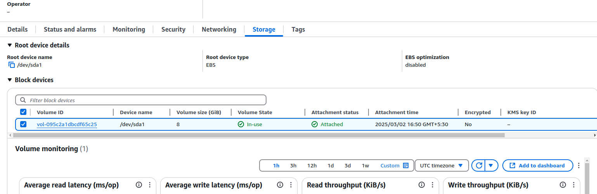
* When we create ec2 instance,by default root ebs volume will be attached.
* By default,it is selected as checkbox as delete on termination.
* we can attach multiple ebs volumes into single ec2 instance.
* In EC2 instance,click on Volumes under Elastic Block Storage.
* click on create volume,select volume type as gp3,enter size 2gb,keep IOPS as default vaule.
* Az details of EC2 is available in Networking section.
* Select AZ where your EC2 instance present,click on create volume.
* it will take around 1min to create and available to use.
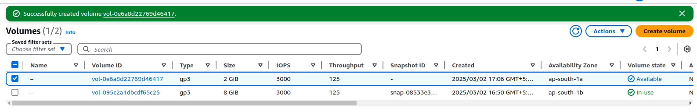
* Now we can attach second ebs volume
* Select newly created ebs volume,click on Action,select attach volume.
* Select instance from drop down and select device name form drop down(/dev/sdf).
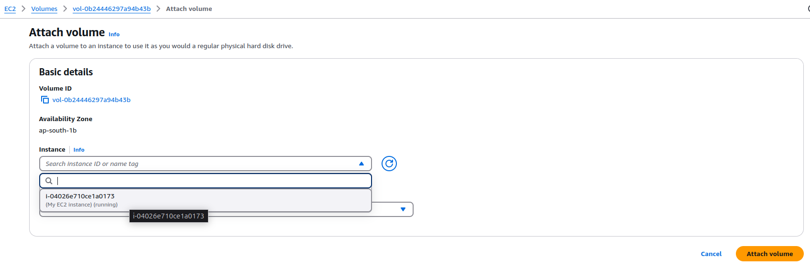
* Click on attach volume. 
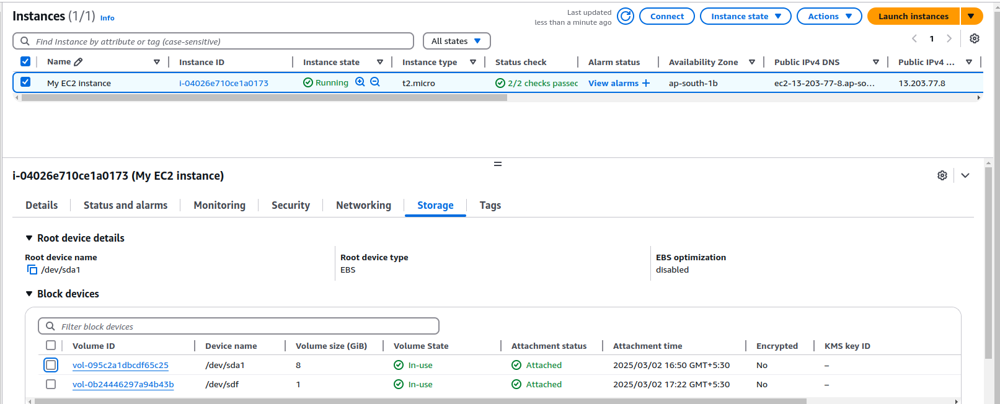
* By default root EBS have selected checkbox Delete on termination.
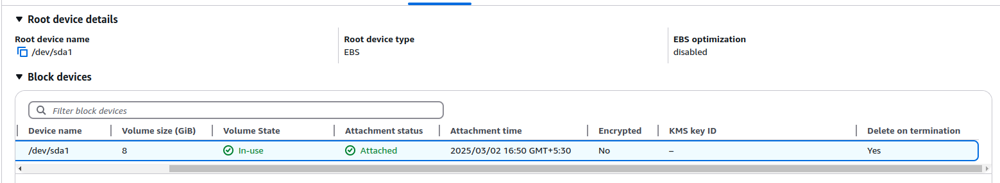

**EBS volume locked to AZ Hands On**
* As we discussed,EBS is locked to Availability Zone.
* created EBS in different AZ,try to attach
* click on volume,Action, click on Attach Volume 
* Select instance from drop down,no ec2 instances are showed because volume in different AZ.
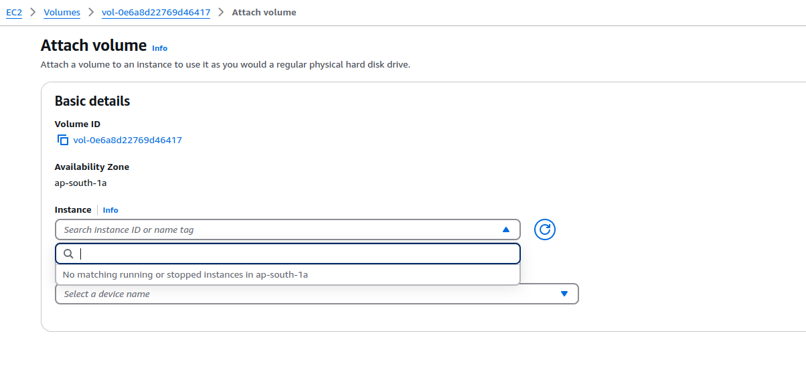

**EBS volume Detach Hands On**
* Select volume,Action,click detach volume.
* It take some seconds to detach.
* Show the Volume state as  Available,we can attach to any other instance.

**EBS Snapshot Hands On**
* Select volume,Action,click on create snapshot 
* Give description,click on create snapshot
* On left-side menu,click snapshots under Elastic Block Store.
* Show the snapshots.

**Copy snapshot into other region Hands On**
* Select snapshot,Action,click on copy Snapshot.
* Provide description and select region.
* click on copy snapshot

**Creation of EBS volume from snapshot Hands On**
* Select snapshot,Action,Click on create volume from snapshot
* Select volume type,Az,size,IOPS 
* Click on create volume.

**Moving snapshot to achive to save charges Hands On**
* Select snapshot,Action,Archive snapshot
* click on Archine snapshot.

**Recycle Bin Hands On**
* Recycle bin is available to protect accidental deletion of snapshots and admin
* Click on create retention rule
* Provide name,select resource type as snapshot or AMI.
* Select check box to apply to all resources.
* give Number of days,select unlock to delete rule any time.
* Click on create retention rule.
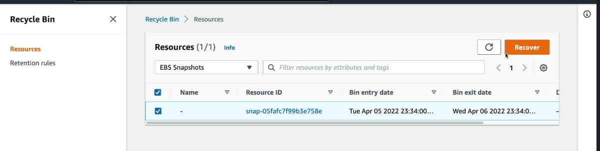

**AMI Overview**
* AMI stands for Amazon Machine Image, it is a customization of your EC2 Instance.
* You can add your own configuration,software,os etc and build it.
* AWS provide Amazon linux as AMI to use in EC2 instance.
* We can sell/buy custom AMI from AWS marketplace AMI.
* AMI will help to save time if we got all required software,configuration as part of custom AMI,
  we can launch EC2 from custom AMI and use it.

**AMI Build Process**
* Start EC2 instance 
* Install all required softwares,update configurations
* stop the Instance
* Build AMI,we can copy AMI into other region also.
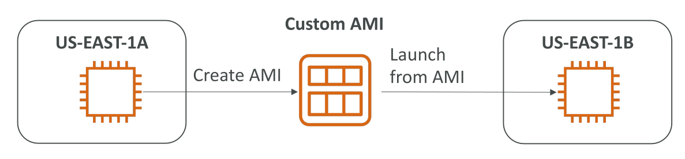

**AMI Hands On**
* Create EC2 instance by selecting any AMI(Amazon linux,ubuntu etc).
* As of now, i am  going with Amzaon linux.
* Install httd on EC2 instance using EC2 user data.
* Instead of httd,we have security configuration update commands in real time.
* EC2 instance take minutes to up and running,will wait for minute.
* Select ec2 instance,Action,Image and Temaplates,create image.
* Provide name to image,keep root volume and other volume settings as same.
* Click on create image.
* Come down,check for AMIs under Images section.
* AMI image will be available
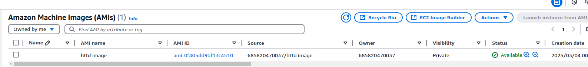

**Creation of EC2 instance from custom AMI image**
* Click on launch,select My AMIs section.
* Click on owned by me and select AMI.
* Click on launch instance,as part that AMI httd will come,not need to install it again.
* Boost time will be faster with required softwares.
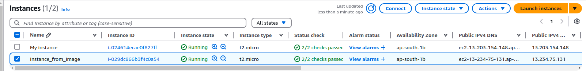

**Summary**
* We can save time by creating custom AMI.

**EC2 Instance Store**
* EC2 instance store is name of physical hardware disk.
* EC2 instance is virtual machine but it is abiously attach to real hardaware server.
* Why we call as virtual machine because we don't have ideo where exactly physical server present but we are accessing resource.
* we will attach hardware disk to EC2 Instance to have high I/O perfomance.
* EC2 instance store lose date if they are stopped.
* Good for cache,scratch data,temp data.
* we are resposible for taking backup of data.
* In exam if they ask for which one to use for better I/O performance,EC2 instance store.
* EBS volume communicate over network with EC2 instance,so performance is good.

**EBS Volume Types**
* There are 6 types in EBS volume.
* gp2/gp3 --> General purpose SSD volume that balance the price and performance for a wide varity of workloads
* ip1/ip2 block express --> Highest perfomance SSD volume for mission-critical workloads or high troughputs workloads.
* st1 --> low cost HDD volume desgined for frequently accessed and troughputs intensive workloads.
* sc1 --> lowest sot SSD volume designed for less frequently access workloads.
* EBS volumes are characterized in size|Troughputs|IOPS(input/output operation per second)
* Only gp2/gp3 and io1/io2 are used as boot volume(root storage) for ECC2 instances.

* gp2/gp3 and io1/io2 are most impartant for exam.

**General Purpose SSD(gp2/gp3)**
* cost effective storage,low latency.
* gp2/gp3 can be used in system boot volumes,virtual desktop,development and test environments.
* gp3 
   is newer generation of volume in gp2.
   baseline of 3000 IOPS and troughputs of 125MiB/s.
   can inscrease up to 16,000 IOPS and troughputs up to 1000Mib/s,both are independent.
* gp2 
  is older generation of volume.
  size of volume and IOPS are linked in gp2.
  3 IOPS per GB so required 5334 GB we are at max IOPS.

**Provisioned IOPS SSD(IO1/IO2)**
* io1/io2 can be used in critical business applications with sustained IOPS performance.
* used in applications that need more than 16,000 IOPS.
* Great for database workloads,in exam asked for best volume for databases to have performance and consistency. 
*  io1(4GiB-16TiB)
   Max PIOPS: 64,000 for nitro ec2 instance and 32,000 for other.
   can inscreate PIOPS independently with storage size.
* io2(4Gib-16TiB)
   sub-millisecond latency.
   Max PIOPS 2,56,000 and can be achived by IOPS:GiB ratio of 1000:1.
   supports for muti-attach

**Hard Disk Drive** 
* can't be a boot volume
* size can be 125GiB to 16TiB
* Troughputs optimized HDD(st1)
   Big Data,Data warehouses,Log processing
   Max troughputs 500MiB/s - Max IOPS 500
* Cold HDD(sc1)
   for data that is infrequently accessed 
   lowest cost
   Max troughputs 250MiB/s - Max IOPS 250

* Summary:
   Have idea on IOPS and troughputs support from gp2/gp3 and io1/io2.

**EBS Multi-Attach - io1/io2**
* we can attach same EBS volume to multiple EC2 instances in same availability zone.
* This feature only available in io1 and io2 family of EBS volume.
* Each instance have full read and write permission to high performance volume.
* Use case:
   Achieve higher application availability in clustered linux applications
   Applications must manage cuncurrent write operations
* We can attach up to 16 instances at a time(may ask in exam). All instances must be in same availability zone.
* Must use a file system that's cluster-aware, not like XFS,EXT4 etc.
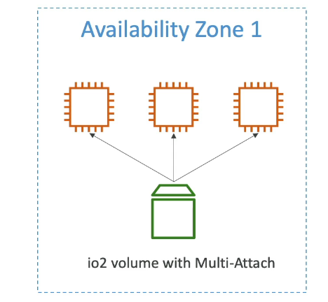

**What is file storage and block storage?**
* File storage: 
  * Data is stored in hierarchical structure with files organized in directories and sub-directories.
    hierarchical structure is organized way of arranging data(we own how we are storing the data) in a tree-like structure and 
    below is called hierarchical structure.
    Example of a Hierarchical File System Structure
    
         / (Root)
         │
         ├── home
         │   ├── user1
         │   │   ├── documents
         │   │   │   └── report.docx
         │   │   ├── pictures
         │   │   │   └── vacation.jpg
         │   │   └── music
         │   │       └── song.mp3
         │
         ├── etc
         │   └── config.yaml
         │
         └── var
            └── log
            └── system.log

   * Our laptop is file storage,onedive and google drive is file system
   * Analogy: Think of file storage as a well organized filing cabinet with labeled folders.
   * Use file storage when you need collaboration, scalability, and shared access(multiple peoples read/write into same data).

* Block storage: 
  * Data is divided into fixed-size-block,each with its own unique address,threse blocks are managened independently.
    Example of Fixed-Size Blocks in Action
      Imagine saving a 3 MB file on a storage system(EBS) that uses 1 MB blocks. The system will break the file into 3 separate blocks:
      [ Block 1 ] [ Block 2 ] [ Block 3 ]
   * Amazon EBS,Azure Disk storage etc.
   * Analogy: Think of block storage as a stack of building blocks --> each block holds data,and you can arrange them however your system requires.
   * Use block storage for low latency, high performance, and dedicated access — especially for database storage.
   

The main differene and use case of file storage and block storage is
   * The way of storing the data is different
   * Use cases is different

**why we need database instead of file system?**
* we can't handle large data in file system.
* Easy access and manage of large data,we required database.
   we have queries to access data easilly and manage it.

**Elastic File System**
* EFS stands for Elastic file system,it is a network file system.
* EFS work with EC2 instances in multiple AZ.
* EFS is highly available,scalable and expensive(3x of gp2) and pay to use.
* File system can scale  automatically,pay per use,no capacity planing.
* Use security group to control access to EFS.
* Use cases: web serving,content management system and data sharing.
* Compatible with linux based amazon machine image(not windows)
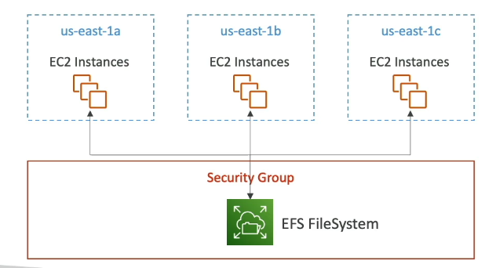

**EFS Performance settings**
* Performance Mode:(set at EFS creation time), we have following options to configure
   * General purpose(default): latency-sensitive(good for low latency) use case such as web server,Content management system etc.
   * Max I/O: higher latency,throughput,highly parallel use case such as big data,media processing
* Throghput Mode:
   * Bursting: Provide throughput that scales with amount of storage --> 1TB storage = scales 50MiB/s + burst of up to 100MiB/s
   * Enhanced:
      * Provisioned:  set your throughput regardness of storage size , Ex: 1GiB/s for 1TB storage.
      * Elastic: Automatically scale throughput up or down based on your workloads
 
**EFS Storage classes settings**
* Storage tier: is a lifecycle management feature - move files after N days,storage tier have below options
  * standard: for frequently accessed files.
  * infrequently access(EFS-IA): cost to  retrieve file,lower price to store.
  * Archive: rarely accessed data(few times a each year),50% cheaper.
  * we need to implement lifecycle polices to move files between storage and tiers 
  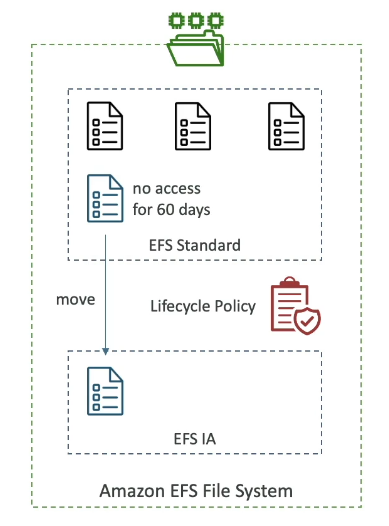

* Availability and Durability: 
  * Regional: Multi AZ,great for production workloads
  * One zone: one zone,great for dev,backup enabled by default,compatable with IA

**EFS Hands On**
* Go to security group,create SG for EFS,don't have inbound rule and have default outbound role.
* Search elastic file system,click on create file system.
* click on customize,provide name
* Select file system type
   * Regional --> we will be available in multiple AZ and good for production wordloads.
   * Onezone --> We will be available in only one zone which you selected from drop down.
* Enable automatic backup to have backup 
* On lifecycle management,select options to move files after N days.
      * Transition into Infrequent Access (select days)-->
          After selected days if file not accessed,move to IA storage tier
      * Transition into Archive.
          After selected days if file not accessed, move to Archive tier
      * Transition into standard
          Select as first access,move file into standard tier when it accessed.
* Enable encryption at rest to have encryption while storing and descryption while accessing.
* Performance settings
   * Troughput mode:
     * Busting: Troughputs scales with the amount of storage which your using.
     * Enhanced:
        Elastic: 
            Regardness of storage,will provide trroughputs,automatically scales based on workload,pay per use.
            this is best when we have unprictable workloads
        Provisioned: 
           Provide how much troughputs needed and right will show max troughput will handle,
           pay in advance as we confirmed we need particular amount of troghtputs.
   * Performance mode
     * General purpose: general purpose only option if we go with Elastic in enhanced mode,
       because we no need to mention troughputs,automatically scales.
     * Max I/O: when we go with burst mode or Provision in enhanced mode,we need to mention I/O because we are aware on troughputs.
* In AZ,select vpc,we have assigned subnets,auto IP,we have created security group for EFS.
* Select SG,file system polict is bit advance we will cover in other thing.
* Review and click create.
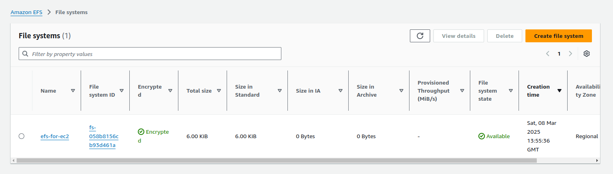

**Mounting EFS into multiple EC2 instance**
* Create EC2 instance
* While creating Ec2 instance,under network setting we need to select subnet where EFS is available.
* click on edit in File Systems under configure storage section.
* Select EFS,click Add shared file system, provide mount directory(mnt/efs/fs1)
* AWS will create SG and attach to ec2 to access EFS,also run required script to mount shared file system
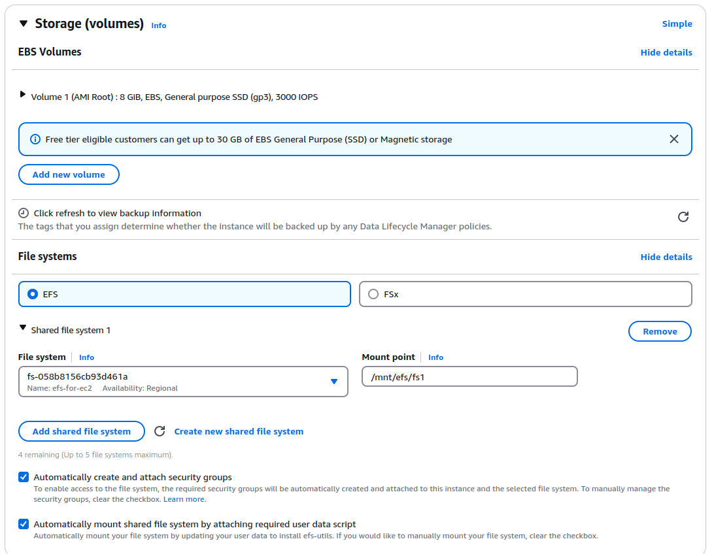
* Click on launch
* create another instance with same setting
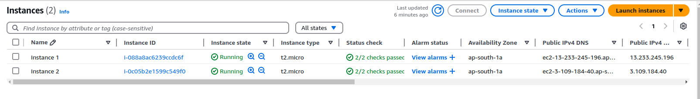
* Connect to fisrt instance,create any file under /mnt/efs/fs1,same will be available in second instance.
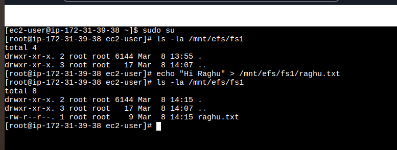
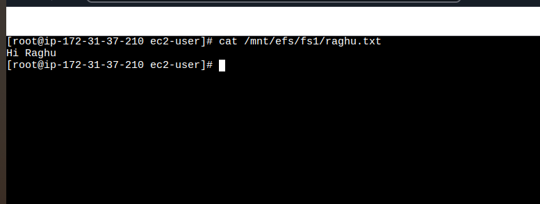
* This is power of EFS to have shared file system across EC2 instances in different AZs.

**EBS vs EFS vs EC2 instance store**
* EBS:
  * EBS overwiew:
     * We can attach only one instance to EBS(only  io1/io2 will have multi attach)
     * EBS are locked to AZ
     * gp2: IO increase if disk size is increase
     * gp3 and io1 can inscrease IO independently
  * To migrate EBS volume across AZ
     * Take snapshot
     * Restore the snapshot to another AZ
       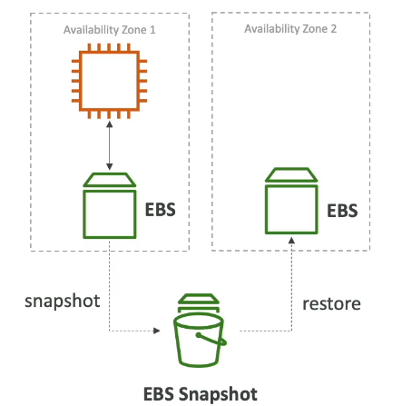
  * Root volume of EC2 Instance will get deleted by default if EC2 instance got terminated.

* EFS:
  * mount 100s of ec2 instances across AZ
  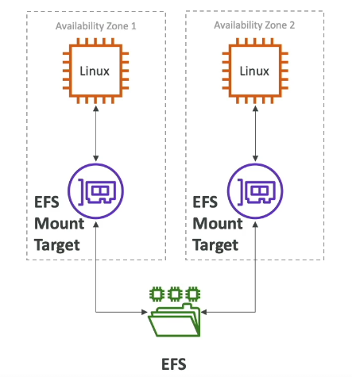
  * EFS share website files
  * only for linux instances
  * EFS have higher price point over EBS
  
* EC2 instance store:
  * It is physical hardware drive,attached to EC2 instance.
  * data will be loosed once ec2 instance got terminated
  * used for temp store,cache store

